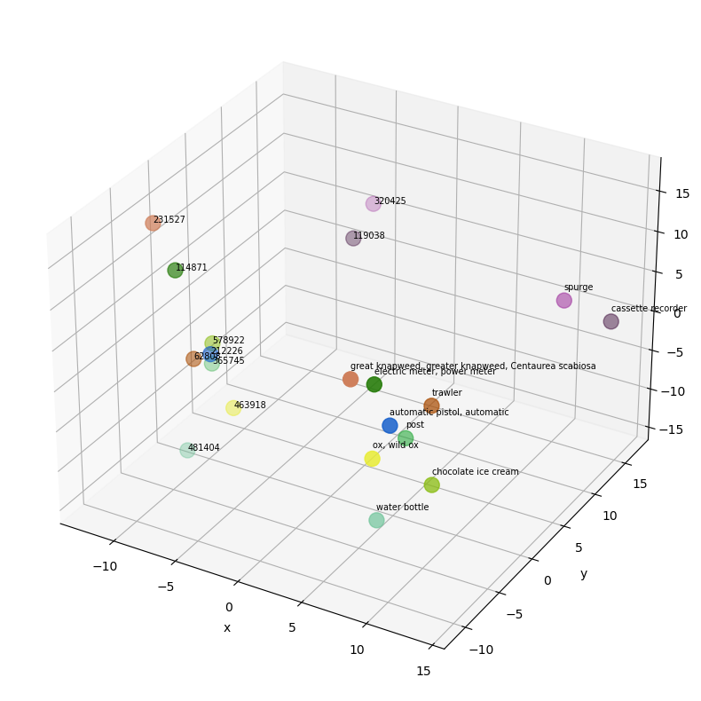
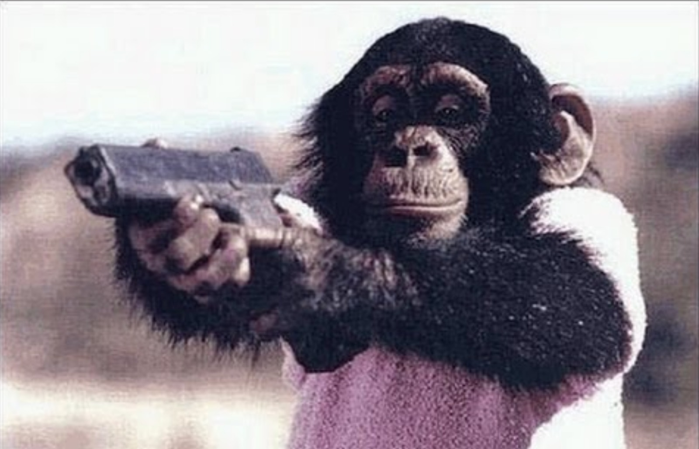

# Socratic Models: Composing Zero-Shot Multimodal Reasoning with Language, Free of Charge

> Ryan Amaudruz, Abhinav Bhuyan, Milena Kapralova, Bogdan Palfi, Alexandru Turcu  
>  Project Report, Deep Learning 2 University of Amsterdam

## Introduction

Socratic models [1] (SMs) is a modular framework in which multiple pre-trained models are composed zero-shot via multimodal informed prompting, which acts as a method of exchanging information between the models. Such models range from pure language models (LM), whose input and output are exclusively textual, to visual-language (VLM) and audio-language models (ALM), which transform visual or audio information into text. In addition to these DL models, the framework can also incorporate modules that rely on the user's input or on specific APIs (e.g. robot actions). The main benefit of this framework is that it can be used to capture new multimodal, zero-shot reasoning capabilities without requiring task-specific fine-tuning. However, the model proposed by Zeng et al. [1] uses the GPT-3 LM [12], which is a proprietary API. We aim to bridge the gap between the performance of SMs using proprietary state-of-the-art language models (LMs) and SMs using open-source LMs in image captioning tasks. Specifically, we use the open-source FLAN-T5 [2, 3] language models developed by Google trained using instruction finetuning.

## Summary of Contributions

The main contribution of the paper [1] is the Socratic Models framework. Additionaly, the paper covers various multimodal prompting methods and offers examples of tasks for which the multimodal capabilities of the SM are required. Therefore, the paper analyzes the zero-shot performance of specific SM configurations on tasks such as image captioning, contextual image description or video-to-text retrieval. All three tasks use the CLIP VLM [5] to extract information from the images, which is then passed to the GPT-3 LM [12] via prompting, whose role is to create a fitting caption or description. The video-to-text retrieval task also uses an ALM [13] to capture audio information which is also given to the LM. A quantitative analysis shows that SM have a higher performance on the zero-shot image captioning task compared to the state-of-the-art (SoTA) ZeroCap [14] but highly under-perform compared to fine-tuned methods such as ClipCap [4]. A similar trend can be seen for video-to-text retrieval, where SM outperform the zero-shot SoTA algorithms but under-perform when being compared to fine-tuned methods such as CLIP2Video [15]. As for the contextual image description task, SM managed to outperform even the fine-tuned method introduced by [16]. Finally, the paper also demonstrates the usage of SM in the context of three applications: egocentric perception, multimodal assistive dialogue and robot perception and planning. Such tasks make use of the user's input as well as APIs for web search and robot control policies. No quantitative evaluation is provided for these applications.

## Related Work

Mokady et al. [4] propose ClipCap, a vision-language model (VLM) using CLIP [5] encoding as a prefix to a caption and then finetuning an LM (GPT2, [6]) to generate the image captions, achieving state-of-the-art on image captioning tasks/datasets. Flamingo by Alayrac et al.
[7] is a suite of vision-language models (VLMs) trained on arbitrarily interleaved text and images, endowing them with in-context few-shot learning capabilities on a range of image and video tasks such as captioning, where they outperform the state-of-the-art. Wang et al. [8] introduce the Generative Image-to-Text Transformer (GIT), a generative VLM with a simplified pipeline which achieves state- of-the-art in image/video captioning and question-answering tasks. BLIP [9] and BLIP-2 [10] are frameworks for bootstrapping vision-language pretraining from frozen pre-trained image encoders and frozen LLMs and achieve state-of-the-art on various vision-language tasks including zero-shot image- to-text generation and image/video captioning. More recently, Koh et al. [11] propose FROMAGe, a method for grounding LMs to the visual domain by freezing the LM and finetuning the input and output layers to enable cross-modality interaction, showcasing strong zero-shot capabilities on grounded tasks such as image captioning and contextual image-to-text retrieval.

## Strenghts and Weaknesses

Strenghts:

1. The code was provided for the image captioning, video-to-text retrieval and robot perception and planning tasks
2. All deep learning models used in the paper are open-source and publicly available
3. The proposed framework outperforms zero-shot SoTA by just using pre-trained methods
4. The proposed framework is applicable for a various number of tasks since it provides multimodal
capabilities

Weaknesses:
1. No code was provided for the other tasks or applications. However, it should be fairly easy to adapt them
2. The GPT-3 LM model is not freely accessible, despite being open-source, so moderate to high funds are needed
3. No proper evaluation was provided for the three applications

## Our novel contribution

Our contribution was twofold. First, we used a different LLM from GPT-3, and second, we used additional, semantic based quantitative metrics to evaluate  quality of the generated captions.

To make the SM framework truly free and open-source, we replaced the costly GPT-3 LM model with a freely accessible although less capable language model FLAN-T5 [2, 3]. GPT-3 has demonstrated a strong ability to summarise and paraphrase information, which allows it to create a clear and concise caption, being less affected by sub-optimal prompts. On the other hand, FLAN-T5 seems to be much more affected by the given prompt, being less capable of paraphrasing information in a realistic way. For instance, FLAN-T5 tends to struggle when the provided prompt contains a large number of similar terms. Therefore, we aimed to bridge the gap between the performance of the two models by using prompt engineering and various pre-processing methods for both the vocabulary and the prompts. To do this, our method creates prompts that are more suitable for FLAN-T5 by paying closer attention to the words that are passed onto the prompt. In this way, the goal would be to not have too similar terms which might be redundant and thus confuse the model. To achieve this goal, we first obtain the cosine similarities between all available terms in the vocabulary. We then build a list of candidate terms that have a high cosine similarity with the image, but a low cosine similarity with the other terms in the candidate list. This is done by looping through the first 100 terms and considering the terms in succession. The first term is included as a default, as it has the highest cosine similarity
and is therefore assumed to be the most relevant. The subsequent terms are then only included if they fall below a cosine similarity threshold of 0.7 when compared to the terms that were previously included as candidates. This first filtering phase allows the algorithm to consider a broader context with more diverse terms. This was not the case in the original paper, which only considered the first 10 terms with the highest cosine similarity, which were often too similar and thus did not contain any new information. In comparison, our method can select objects that are in the top 100 best matches by cosine similarity. In this way, the case in which the top 10 terms are too similar (e.g. synonyms) is less likely since we map these similar terms to just a single word and thus increase the chance of including possibly relevant terms in the top 100.

Empirically, we found that the optimal number of terms to include in the prompt varies from image to image, as some images contain a small number of relevant objects while others have more objects that should be considered. To handle this aspect, our method has a clever way of determining the number of candidate terms that should be included in the prompt. Specifically, we combine the term that has the highest cosine similarity with each of the previously determined candidate terms. We then calculate the cosine similarity between these combinations and the image and verify whether at least one of the combinations managed to achieve a higher cosine similarity compared to the original top term (at least 1% higher). This ensures that only relevant terms that contribute to the image
description are added and all other not-so-relevant terms are filtered out. Finally, we also tested different prompt structures and combinations in order to find a prompt that was best suited for the FLAN-T5 model. More details should be expected in the final version.

## Image Object Selection Algorithm

1. **Input**: `images` (list of images)
   **Output**: `objects` (list of selected objects)

2. Initialize an empty list `objects` to store selected objects.

3. For each `image` in `images`:
     - Initialize an empty list `objects_image` to store selected objects.
     - Get the 100 most similar object categories to `image` based on cosine similarity and order them.
     - Find the `object` corresponding to the maximum cosine similarity value
     - Add `object` to `objects_image`.
     - For each sebsequent `object` in the rest of the ordered list of object categories:
         - Calculate the cosine similarity between `object` and all the objects in `objects_image`.
         - If none of the calculated cosine similarities is higher than the pre-specified threshold:
             - Add `object` to `objects_image`.
     - Add `objects_image` to `objects`.

4. Return `objects` as the final list of selected objects.

The other of our contributions was in extending the evaluation pipeline to include also more semantically informed caption evaluations metrics. Specifically, the authors of the original paper [1] use only rule-based metrics such as BLUE-4, METEOR, CIDEr, SPICE and ROUGE-L to evaluate the quality of generated captions, and those metrics often do not correlate with human judgements, and they also have blind spots to syntactically pathological caption constructions [17], taking into account only information such as n-gram matching, word order, TF-IDF weights, and overlapping sequences of words. To remedy these issues, we iplemented two additional evaluation metrics that better correlate with human judgement [18]: an unscaled CLIP-S score [19] and the BERT score [20].

CLIP-S is an embedding-based approach (based on CLIP embeddings), and are supposed to capture the semantic overlap between the candidate caption and an image, regardless of some groung truth. To comppute this score, we calculated the cosine similarities between each image embedding and embeddings of the ground truth captions and then we calculate the cosine similarities between each image embedding and embeddings of the captions generated with FLAN-T5. Then we computed the means and standard deviations of these cosine similarities, comparing the baseline and improved model based on the gap between ground truth and reference caption-related cosine similarities.

The BERT score is learning based method to evaluate image captions, exploiting the pre-trained BERT embeddings [] to represent and match
the tokens in the reference and candidate sentences via cosine similarity [21]. To this end, we calculated precision, recall and the F1 score for the baseline and improved model.

## Results

    

        <figure>
            
            <figcaption><strong>Original Socratic (ChatGPT)</strong>: "This photo captures the elegance of a well-designed dining room with a beautiful view."
             <strong>Baseline (Flan-T5)</strong>: "The interior of a home with large windows and wooden shutters and chairs under a stairway."
             <strong>Improved (Flan-T5)</strong>: "The interior of a home with large windows and wooden floors"</figcaption>
        </figure>
    

    

        <figure>
            
            <figcaption><strong>Original Socratic (ChatGPT)</strong>: "A photo of an astronaut enjoying a beer while waiting for a meeting."
             <strong>Baseline (Flan-T5)</strong>: "man resting in spacesuit"
             <strong>Improved (Flan-T5)</strong>: "astronaut relaxes with beer"</figcaption>
        </figure>
    

    

        <figure>
            
            <figcaption><strong>Original Socratic (ChatGPT)</strong>: "This photo chimpanzee was taken at a veterinarians office."
             <strong>Baseline (Flan-T5)</strong>: "There is a chimpanzee in this photo"
             <strong>Improved (Flan-T5)</strong>: "The chimpanzee wants to shoot at the person." </figcaption>
        </figure>
    

    

        <figure>
            
            <figcaption><strong>Original Socratic (ChatGPT)</strong>: "A close-up of a dish rack, with various plates and bowls stacked neatly inside."
             <strong>Baseline (Flan-T5)</strong>: "A dish-rack has dishes in it."
             <strong>Improved (Flan-T5)</strong>: "A basket of fruit in a stand."</figcaption>
        </figure>
    

We present both quantitative and qualitative reults. Qualitative results show the vast improvement of the model compared to baseline (Figure 1), and the quantitative results confirm this observation (Table 1).

[Figure 1: Demo | Pictue of the astronaut with beer and the generated captions scored as most likely.]

[Table 1]: Rule-based metrics to compare the baseline and improved models to the SoTA in image captioning and the original paper [1], and the embedding-based, and learning-based metrics to compare the baseline and improved models to each other.

## Conclusion

Good performing LLMs and the resultant Socratic models don't have to be expensive. With careful prompt post-processing, we demostrated that we can achieve high performance on image captioning even with open-source models such as FLAN-T5.

## Individual contributions

All group members contributed equally.

## References 

[1] Zeng, A. et al. Socratic models: Composing zero-shot multimodal reasoning with language. arXiv
preprint arXiv:2204.00598 (2022).

[2] Chung, H. W. et al. Scaling Instruction-Finetuned Language Models 2022. arXiv: 2210.11416
[cs.LG].

[3] Longpre, S. et al. The Flan Collection: Designing Data and Methods for Effective Instruction
Tuning 2023. arXiv: 2301.13688 [cs.AI].

[4] Mokady, R., Hertz, A. & Bermano, A. H. ClipCap: CLIP Prefix for Image Captioning 2021.
arXiv: 2111.09734 [cs.CV].

[5] Radford, A. et al. Learning Transferable Visual Models From Natural Language Supervision 2021.
arXiv: 2103.00020 [cs.CV].

[6] Radford, A. et al. Language models are unsupervised multitask learners. OpenAI blog 1, 9 (2019).

[7] Alayrac, J.-B. et al. Flamingo: a visual language model for few-shot learning. Advances in Neural
Information Processing Systems 35, 23716–23736 (2022).

[8] Wang, J. et al. GIT: A Generative Image-to-text Transformer for Vision and Language 2022.
arXiv: 2205.14100 [cs.CV].

[9] Li, J., Li, D., Xiong, C. & Hoi, S. BLIP: Bootstrapping Language-Image Pre-training for Uni-
fied Vision-Language Understanding and Generation in Proceedings of the 39th International
Conference on Machine Learning (eds Chaudhuri, K. et al.) 162 (PMLR, 2022), 12888–12900.
https://proceedings.mlr.press/v162/li22n.html.

[10]  Li, J., Li, D., Savarese, S. & Hoi, S. BLIP-2: Bootstrapping Language-Image Pre-training with
Frozen Image Encoders and Large Language Models 2023. arXiv: 2301.12597 [cs.CV].

[11]  Koh, J. Y., Salakhutdinov, R. & Fried, D. Grounding Language Models to Images for Multimodal
Generation 2023. arXiv: 2301.13823 [cs.CL].

[12]  Brown, T. et al. Language models are few-shot learners. Advances in neural information processing
systems 33, 1877–1901 (2020).

[13]  Bapna, A. et al. mSLAM: Massively multilingual joint pre-training for speech and text 2022.
arXiv: 2202.01374 [cs.CL].

[14]  Tewel, Y., Shalev, Y., Schwartz, I. & Wolf, L. ZeroCap: Zero-Shot Image-to-Text Generation for
Visual-Semantic Arithmetic 2022. arXiv: 2111.14447 [cs.CV].

[15]  Fang, H., Xiong, P., Xu, L. & Chen, Y. CLIP2Video: Mastering Video-Text Retrieval via Image
CLIP 2021. arXiv: 2106.11097 [cs.CV].

[16]  Kreiss, E., Fang, F., Goodman, N. D. & Potts, C. Concadia: Towards Image-Based Text Gener-
ation with a Purpose 2022. arXiv: 2104.08376 [cs.CL].

[17] Cui, Y., Yang, G., Veit, A., Huang, X., & Belongie, S. J. (2018). Learning to Evaluate Image Captioning. CoRR, abs/1806.06422. Retrieved from http://arxiv.org/abs/1806.06422.

[18] M. Stefanini, M. Cornia, L. Baraldi, S. Cascianelli, G. Fiameni and R. Cucchiara, "From Show to Tell: A Survey on Deep Learning-Based Image Captioning," in IEEE Transactions on Pattern Analysis and Machine Intelligence, vol. 45, no. 1, pp. 539-559, 1 Jan. 2023, doi: 10.1109/TPAMI.2022.3148210.

[19] Hessel, J., Holtzman, A., Forbes, M., Le Bras, R., & Choi, Y. (2021, November). CLIPScore: A Reference-free Evaluation Metric for Image Captioning. Proceedings of the 2021 Conference on Empirical Methods in Natural Language Processing, 7514–7528. doi:10.18653/v1/2021.emnlp-main.595.

[20] Zhang, T., Kishore, V., Wu, F., Weinberger, K. Q., & Artzi, Y. (2019). BERTScore: Evaluating Text Generation with BERT. CoRR, abs/1904.09675. Retrieved from http://arxiv.org/abs/1904.09675.

[21] J. Devlin, M.-W. Chang, K. Lee, and K. Toutanova, “BERT: Pretraining of deep bidirectional transformers for language understanding,” NAACL, 2018.
