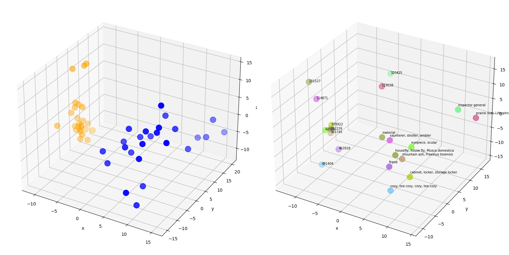
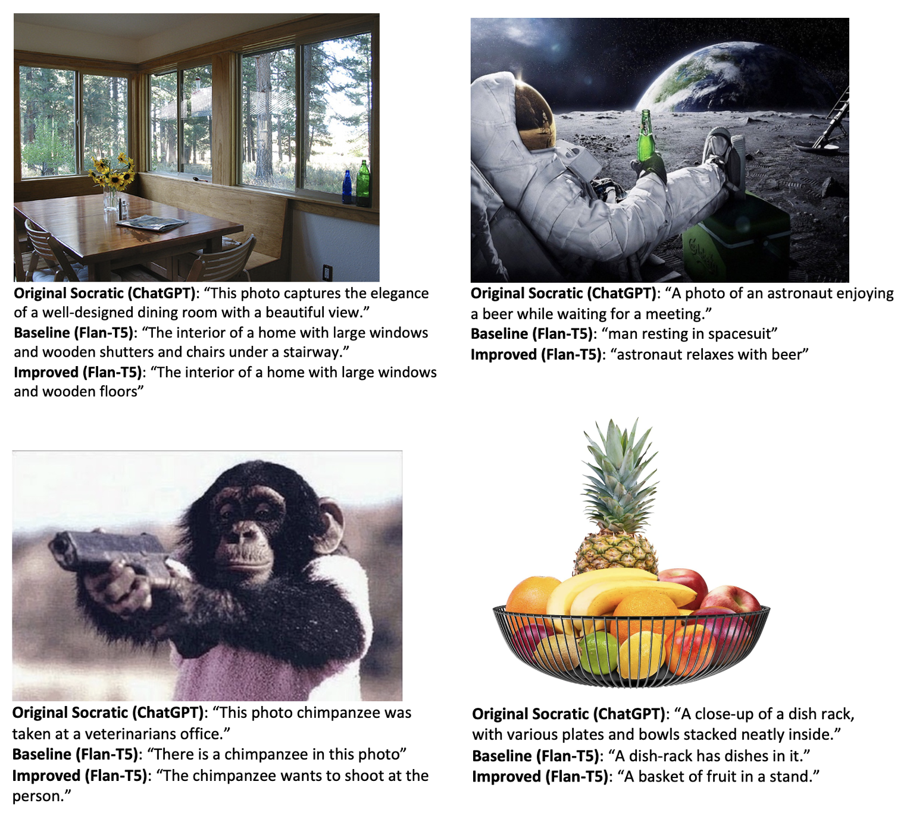
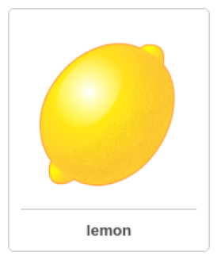
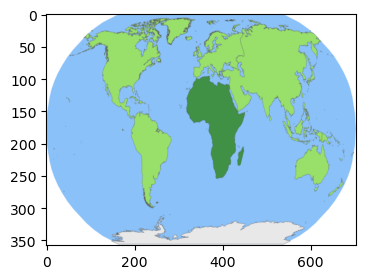
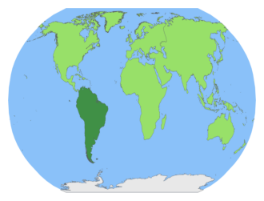

# Socratic Models: Composing Zero-Shot Multimodal Reasoning with Language, Free of Charge

> Ryan Amaudruz, Abhinav Bhuyan, Milena Kapralova, Bogdan Palfi, Alexandru Turcu  
> Project Report, Deep Learning 2 University of Amsterdam

## Abstract
Socratic models [1] is a modular framework in which multiple pre-trained models are composed zeroshot via multimodal informed prompting. This is done to exchange information between models and capture new multimodal capabilities, without requiring finetuning. As a proof of concept, we modify the Socratic models framework such that it is entirely open-source and attempt to achieve the same results as the original version. Additionally, we investigate the capabilities of Socratic models on multimodal reasoning tasks such as chain-of-thought reasoning and visual question-answering in zero-shot and few-shot settings.

## 1. Introduction
Socratic models (SMs) [1] are a fairly new addition to the field of deep learning and comprise a modular framework, which employs multiple pre-trained deep learning (DL) models to solve specific tasks. Such models range from pure language models (LM), whose input and output are exclusively textual, to visual-language (VLM) and audio-language models (ALM), which transform visual or audio information into text. In addition to these DL models, the framework can also incorporate modules that rely on the user’s input or on specific APIs (e.g. robot actions). The framework uses prompting as a form of exchanging information between these models, a technique known as the ’Socratic method’. The main benefit of such an approach is that it offers zero-shot multimodal capabilities without requiring task-specific fine-tuning. This has far-reaching consequences for the future development of more generalized artificial intelligent systems.

Because of their ability to communicate across multiple modalities and the dominant role of LMs in the framework, SMs have been hypothesized to perform well on reasoning tasks. Various authors have explored the ability of LMs to perform tasks such as arithmetic [2] and symbolic reasoning, with promising results. Notably, [3] introduced chain-of-thought (CoT) reasoning, a method for prompting LMs to perform reasoning tasks such as solving algebraic questions by generating the intermediate steps or rationale for the problem. While this is usually done in a few-shot setting by prompting the LM with exemplar rationales and answers [3, 4], this effect has also been demonstrated in a zero-shot manner, by carefully designing the question prompt [5]. While current studies have relied on the LM to perform reasoning, [6] also explore the possibility of CoT reasoning in a multimodal setting, using a combination of text and image prompts.

All tasks presented in [1] employ the CLIP [7] VLM to extract information from the images, which is then via prompting passed to GPT-3 [8] LM - an autoregressive decoder - whose role is to create a fitting caption or description. A quantitative analysis shows that SM have a higher performance on the zero-shot image captioning task compared to the state-of-the-art (SoTA) ZeroCap [9] but highly under-perform compared to finetuned methods such as ClipCap [10], which uses a CLIP [7] encoding as a prefix to a caption and then fine-tunes an LM (GPT2, [11]) to generate the image caption. A similar trend can be seen for videoto-text retrieval, where SM outperform the zero-shot SoTA algorithms but under-perform when being compared to fine-tuned methods such as CLIP2Video [12]. As for the contextual image description task, SM managed to outperform even the fine-tuned method introduced by [13]. Therefore, the aim of this project is to build on top of the model proposed by [1] in the following ways:

1. **Using FLAN-T5 XL instead of GPT-3**. The model proposed by [1] uses the GPT-3 LM, which is a proprietary API of OpenAI. We will refer to this model as the *original Socratic model*. To make the SM framework truly free and open-source, we replace the costly GPT-3 LM model with a freely accessible - although smaller and possible less capable - language model FLAN-T5 [14, 15]. This model was developed by Google, has an autoregressive encoder-decoder architecture and was trained using instruction fine-tuning. This will comprise our *baseline model*.

2. **Improving the performance on FLAN-T5 XL**.
   GPT-3 has demonstrated a strong ability to summarise and paraphrase information, which allows
   it to create a clear and concise caption, being less affected by sub-optimal prompts. On the
   other hand, FLAN-T5 seems to be much more affected by the given prompt, being less capable
   of paraphrasing information in a realistic way. For instance, FLAN-T5 tends to struggle when
   the provided prompt contains a large number of similar terms - e.g. an image portraying a
   monkey would have a prompt containing the words monkey, ape, chimpanzee, primate etc. which
   are synonyms. Therefore, we propose a new prompt pre-processing method, called Synonym
   Exclusion (SE), which is based upon the PCA analysis of CLIP’s embedding space. Additional
   prompt engineering methods were tested but were not included since no performance increase
   was seen. We will refer to the model where SE is employed as the *improved model*.

3. **Extending the evaluation on the image captioning task**.
The original paper used qualitative and lexical-based quantitative metrics. However, those often do not correlate with human judgments, and have blind spots to syntactically pathological caption constructions [17], taking into account only information such as n-gram matching, word order, TF-IDF weights, and overlapping sequences of words. We therefore also utilize embedding- and learning-based metrics that better correlate with human judgement [18] such as BERT scores to evaluate the capabilities of the image captioners.

4. **Comparing the models’ performance to GIT and BLIP**.
We also aimed to compare the performance of SM to non-Socratic models such as GIT and BLIP. Generative Image-to-Text Transformer (GIT) [16] is a generative VLM with a simplified pipeline that achieves high performance in image/video captioning and question-answering tasks. On the other hand, BLIP [17] and BLIP-2 [18] involve bootstrapping vision-language pre-training from frozen pre-trained image encoders and frozen large LMs, achieving improved performance on various vision-language tasks including zero-shot image-to-text generation and image/video captioning.

5. **Applying the SM framework to multimodal reasoning tasks**. 
We additionally explore the capabilities of Socratic models on 2 types of multimodal reasoning tasks: chain-of-thought (CoT) reasoning and visual question-answering, in both zero-shot and few-shot settings. Intuitively, we would expect the SM framework to excel in reasoning tasks due to their ability to exchange information across modalities, leading to more efficient cross-modal discourse and knowledge sharing. While the original authors perform a range of open-ended reasoning tasks including (video) summarization, open-ended Q&A, forecasting, image/audio retrieval from video, and reasoning for robotic actions, their experiments are limited to the domain of (egocentric) video. We extend upon their work by applying reasoning for visual question answering on images, and further applying chain-of-thought reasoning as a mechanism to improve their reasoning abilities. Our efforts would serve as a handy framework and proof-of-concept for the application of SMs in multimodal reasoning tasks, leading to more robust, intelligent systems which can apply reasoning and generalize across multiple domains.

6. **Making the pipeline more flexible, reproducible and efficient**.
We bring forth a modular codebase that makes it easy to build upon and test different captioning methods, including the usage of seeds, split between train, valid and test sets. We also provide a random and grid search pipeline to find the best hyperparameters. Finally, as the loading of the files and the generation of the embeddings is quite consuming, we have implemented a caching functionality that speeds up the development and testing process.

## 2 Method
### 2.1 Image captioning
#### 2.1.1 The Socratic method
The general pipeline for the Socratic image captioning follows the formula: *caption = fVLM ( fLM ( fVLM (image)))*.
Specifically:
1. The VLM (CLIP) is fed an image and is used zero-shot to detect variables of interest: place categories (Places365 [19]), object categories (from Tencent ML-Images [20]), image type and the number of people. The top-*k* ranked in each category can then be substituted into an LM prompt.
2. Given the VLM-informed language prompt, the LM generates several *n* candidate captions. For this step, we use a non-zero next-token sampling temperature (e.g. 0.9), to return sufficiently diverse, but reasonable results across the n candidates.
3. Finally, these *n* captions are then ranked by the VLM based on their cosine similarity to the image, the highest-scoring caption being returned.

#### 2.1.2 The Synonym Exclusion algorithm

The reason for this method is the observation that FLAN-T5 produces low-quality captions compared to GPT-3 when the VLM-informed prompt contains too many similar words referring to the same object. For example, when given the wedding image below (Figure 1), The VLM prompt contains the sentence: I think there might be a dress suit, full dress, tailcoat, tail coat, (etc.) in this photo.” and FLAN-T5 might generate this caption: ”A wedding dress is paired with a tuxedo for an elegant wedding.” This might be because GPT-3 relies on an autoregressive decoder that predicts subsequent words based on the previously generated ones (known as unidirectional language modeling) while FLAN-T5 uses masking, and specifically span-corruption: by masking specific segments of the text phrase, FLAN-T5's decoder is trained to predict the words that were hidden within these masked regions. Therefore, when summarizing text with many synonyms, a model trained with span corruption - like FLAN-T5 - may struggle, as the presence of multiple synonymous phrases can introduce ambiguity and make it harder for the model to generate concise summaries. In contrast, a model trained with unidirectional language modeling - like GPT-3 - focuses on coherence and capturing long-range dependencies, and so can produce better summaries.

  

> Figure 1: Image for which CLIP produces too many synonyms

Our method (outlined in the SE Algorithm snippet below) creates prompts that are more suitable for FLAN-T5 by paying closer attention to the words that are passed onto the prompt. In this way, the goal would be to not have similar terms that might be redundant and thus confuse the model. To this end, we build a list of candidate terms that have a high cosine similarity with the image, but a low cosine similarity with the other terms in the candidate list. This is done by looping through the first 100 terms and considering the terms in succession. The first term is included as a default, as it has the highest cosine similarity and is therefore assumed to be the most relevant. The subsequent terms are then compared to previously included candidate terms and are added only if they fall below a predefined cosine similarity threshold. The list of candidate terms also has a predefined maximum number of allowed candidates, *n*. In this way, the top *n* positions are more likely to contain relevant and distinctive terms. We determined threshold for cosine similarities using Principal Component Analysis (PCA), a dimensionality reduction technique that identifies the most significant directions of variation in a dataset. This enables the representation of data with fewer dimensions while preserving its key features. We noticed that even though the ground truth captions have similarity between the corresponding image of around 0.25, using this threshold for our SE algorithm did not filter synonyms effectively and produced subpar captions. Since both images and text share embedding space in CLIP, we analyzed this space using the PCA.

##### The SE Algorithm
> 1. *Input*:
>    - CLIP embeddings of `images`
>    - CLIP embeddings of `object categories`
>
>   *Output*:
>    - `objects` (list of selected objects for all images)
>
> 2. Initialize an empty list `objects`.
>
> 3. For each `image` in `images`:
>    - Initialize an empty list `objects_image` to store selected objects for one image.
>    - Get the 100 most similar `object categories` to `image` based on cosine similarity and order them.
>    - Find the `object` corresponding to the maximum cosine similarity value
>    - Add `object` to `objects_image`.
>    - For each subsequent `object` in the rest of the ordered list of object categories:
>        - Calculate the cosine similarity between `object` and all the objects in `objects_image`.
>        - If none of the calculated cosine similarities is higher than the pre-specified threshold:
>            - Add `object` to `objects_image`.
>    - Add `objects_image` to `objects`.
>
>4. Return `objects` as the final list of selected objects.

As can be seen from Figure 2 below, we visualized 25 random images (in yellow) and their corresponding 25 random object categories (in blue) by reducing their CLIP embeddings from 768 to 3 dimensions (left). Additionally, we examined the best-matching object category for each of 10 random images and represented them with matching colors (right). In both cases, we saw that image and text cluster together, even in the best-matching scenario. This indicates that texts exhibit greater similarity among themselves than with images, emphasizing the need for higher thresholds to filter out text-text synonyms. 

  

> Figure 2: Visualisation of CLIP's embedding space.

#### 2.1.3 Dataset
Images used in this project were extracted from the MS COCO [21], a large-scale dataset often used for image captioning tasks. The dataset also contains natural language image descriptions. We used the 2017 validation split which contains 5000 images, out of which we randomly selected two groups of 50 images to be used during hyperparameter search and testing, under the constraint that there is no overlap between the two groups of images.

#### 2.1.4 Hyperparameter search

We tuned several hyperparameters, including the temperature of the language model, which controls text randomness and diversity. The number of objects and places provided to the model also impacted performance. We conducted a random parameter search with 100 iterations on the training set to optimize these hyperparameters. The optimal temperature was around 0.55, lower than the default of 1, aligning with our goal of generating high-quality prompts without excessive creativity. The optimal number of objects was 10 for the baseline and 6 for the improved captioner, reflecting the improved model’s ability to filter out redundant objects. For places, the optimal values were 5 for the baseline and 4 for the improved model. We experimented with different caption formats but could not surpass the original Socratic paper’s prompt. Finally, the cosine similarity threshold for the improved method was determined as 0.8.

#### 2.1.5 Evaluation metrics
- *Rule-based metrics*. We used the rule-based metrics reported in the original Socratic paper, specifically BLEU-4 [22], METEOR [23], CIDEr [24], SPICE [25] and ROUGE-L [26]. These metrics measure mainly lexical overlap between ground truth and generated captions.

- *Embeding-based metric*. We used one embedding-based metric, particularly the cosine similarity score, which captures the semantic overlap between the caption and an image. To compute this overlap, we calculated the cosine similarities between each image embedding and embeddings of the captions generated with a specific model. Then we computed the means and standard deviations of these cosine similarities.

- *Learning-based metric*. We used one learning-based metric, specifically the BERT score, which is a method exploiting the pretrained BERT embeddings. Once the final embeddings for each of the words in ground truth and generated captions are obtained, an n-squared computation is performed by calculating similarity for each of the words from ground truth to each of the words in the generated caption. Most similar word from reference to the ground truth one is found and precision and recall are calculated for each model [21].

### 2.2 Chain-of-Thought Reasoning and Visual Question Answering

#### 2.2.1 Model
The pipeline for chain-of-thought reasoning (CoTR) & visual question-answering (VQA) tasks is illustrated in the snippet below. It partially mimics the captioning pipeline; however, we used the GPT-3.5 turbo version (i.e., ChatGPT) as the LM since the reasoning tasks are more complex than the captioning task and hence require a more powerful model. In the 1st stage, we extracted information from the image $I$ by prompting CLIP to ground the image context to a text summary $C_I$ , which was then fed as an input prompt to the LM, which finally generated the output. In the zero-shot CoTR task, the prompt $P$ consists of the question $Q$, choices $MC$, text context $C_T$ and image context $C_I$ . We also appended the phrase ”Let’s think step by step...” ($S_{COT}$) to the prompt, which has been shown to elicit CoT reasoning [5], and the desired output was the rationale $R$ (reasoning steps) and answer $A$. In the few-shot CoTR task, we composed the prompt $P$ by first creating solved examples $E$ (question prompt + solution), and then concatenating the prompt for the zero-shot task. For the zero-shot VQA task, the input prompt $P$ was identical to the zero-shot CoT task but the final sentence $S_{COT}$ was omitted, while the desired output was the answer $A$ (single choice). In the few-shot VQA task we also appended a solved example $E$ to the initial prompt. Example CoTR tasks (zero-shot & few-shot) are shown in the result section below.

**Algorithm: Reasoning with Socratic models**

> **Zero-shot CoT**
>    - *Input*: $Q + C_T + I \to$ $VLM$ $\to P = Q + C_T + C_I + S_{COT} \to$ $LM$ $\to$ *Output*: $R + A$
>
> **Few-shot CoT**
> - *Input*: $Q + C_T + I + E \to$ $VLM$ $\to P = Q + C_T + C_I + S_{COT} \to$ $LM$ $\to$ *Output*: $R + A$
>
> **Zero-shot VQA**
> - *Input*: $Q + C_T + I \to$ $VLM$ $\to P = Q + C_T + C_I + E \to$ $LM$ $\to$ *Output*: $A$
>
> **Few-shot VQA**
> - *Input*: $Q + C_T + I + E \to$ $VLM$ $\to P = Q + C_T + C_I + E \to$ $LM$ $\to$ *Output*: $A$

> Model pipeline for reasoning tasks. $Q$: question, $I$: image, $A$: answer, $C_T$: text context, $C_I$: image context, $R$: rationale, $P$: prompt, $E$: solved example, and $S_{COT}$: *"Let's think step by step..."*.

#### 2.2.2 Dataset
We used the ScienceQA [4] dataset which contains multiple-choice science questions containing text and images, along with solutions and explanations, designed for reasoning tasks such as CoT & VQA. We took the validation split and filtered out samples with (i) no images and (ii) images where the visual context is unnecessary to answer the question. An example question is for example, *”What is the capital of Texas?”*. Finally, we drew 50 random samples each for the CoTR & VQA tasks. The small size of the test set was motivated primarily by the cost of using the proprietary GPT-3 API, but we hope our experiments would still reveal some telling trends and insights.

#### 2.2.3 Evaluation
We evaluated the CoTR tasks using the following metrics: BLEU [22], Rouge [26], METEOR [23], and the BERT score [27] between the generated responses (rationales) and ground-truth solutions. For the VQA tasks, we simply computed the accuracy between generated answers and ground-truths.

## 3 Results

### 3.1 Image captioning

#### 3.1.1 Qualitative demonstrations

> Figure 3: Qualitative results on the image captioning task.

Overall, no image captioning method seems to outperform the rest for all images. Specifically, while the original SM outputs an appropriate caption for the top left image, it seems to hallucinate for the top right, stating that ”the astronaut is waiting for a meeting”. This hallucination might be caused by the limited vocabulary given to the VLM, which does not include the moon as a viable location. In this way, the VLM seems to associate the sitting astronaut with the scenario of a ”waiting room”. Another reason for this hallucination can be that GPT-3 was fine-tuned by few-shot learning, whereas FLAN-T5 was fine-tuned by instruction tuning, which incorporates explicit prompts to guide the model's behavior, providing more control over its output. As for the bottom images, the original SM struggles to recognize the pistol and the fruits. However, it should be stated that GPT-3 is non-deterministic and might generate more appropriate captions. In contrast, the improved model has a higher chance of detecting the relevant objects in the image, generating captions that mention both the gun and the fruit, thus outperforming the original SM for the last two images.

#### 3.1.2 Quantitative comparisons

| Approach                          | Bleu 4 | METEOR | ROUGE L | CIDEr | SPICE | BERT p | BERT r   | Cosine Sim |
|-----------------------------------|--------------|--------------|----------|-------------|-------------|--------|----------|------------|
| GITVision                         | 37.1 ± 32.7  | 31.5 ± 8.8   | 61.0 ± 14.0 | 162.0 ± 81.4 | 24.8 ± 10.7 | 93.4 ± 1.7 | 87.4 ± 1.6 | 25.5 ± 3.8 |
| BLIP                              | 12.9 ± 20.7  | 23.0 ± 8.9   | 49.4 ± 15.1 | 106.2 ± 62.7 | 17.7 ± 9.0  | 91.5 ± 1.9 | 85.6 ± 1.5 | 24.7 ± 3.6 |
| BLIP2                             | 23.9 ± 31.4  | 29.6 ± 12.2  | 58.1 ± 15.4 | 142.6 ± 72.2 | 22.1 ± 8.8  | 92.5 ± 1.7 | 86.6 ± 1.5 | 25.1 ± 3.7 |
| Original Socratic                 | 2.0 ± 9.4    | 15.4 ± 7.4   | 34.4 ± 15.1 | 45.4 ± 50.3  | 9.6 ± 6.6   | 89.8 ± 3.4 | 85.2 ± 1.8 | 25.8 ± 3.2 |
| Baseline Socratic with best params | 6.8 ± 17.4   | 16.8 ± 8.4   | 38.5 ± 15.9 | 57.6 ± 57.8  | 11.9 ± 8.9  | 90.7 ± 3.0 | 85.4 ± 1.7 | 25.3 ± 2.9 |
| Improved Socratic with best params | 2.4 ± 9.9    | 15.1 ± 6.5   | 34.8 ± 14.4 | 49.4 ± 41.7  | 9.7 ± 8.1   | 90.2 ± 2.9 | 84.7 ± 1.7 | 24.6 ± 2.6 |

> Table 1: Quantitative results on MS COCO.

It can be seen from the Table 1 above that the non-Socratic models perform significantly better than the Socratic ones, in terms of all the metrics. This is somewhat expected as some of these models were specifically trained for the task of image captioning, whilst the SMs were used zero-shot. For the SMs, the differences between metrics are less clear due to large uncertainty in measurement, even though all the metrics are positively related to one another, suggesting that those metrics have good validity, particularly the embedding- and the learning-based metrics. Surprisingly, our baseline SM with the fine-tuned parameters seems to performs better than the original SM on all metrics except for cosine similarity, even though the difference might not be meaningful due to large standard deviations. This is despite using a smaller language model, and suggests that it is possible to obtain similar or even superior results than the original SM by carefully prompting the LM. However, the fine-tuned improved SM seems to have performed less well than the baseline model. This means that the promising results that we obtained in the qualitative assessment did not generalize well once we tested it on the MS COCO dataset with the quantitative benchmark.

### 3.2 Chain-of-Thought and Visual Question Answering

This section illustrates examples of each of the CoTR & VQA tasks (zero-shot & few-shot). The results of evaluation are summarized in the table below. We achieved decent zero-shot performance on the CoTR task (BLEU-4=9.12, BERT=86.41), and this spikes drastically in the 1-shot setting (BLEU-4=42.03, BERT=90.97). In the VQA task, the zero-shot accuracy is already high (66.72%) and jumps to 72.91% in the 1-shot case. We refrain from comparing with existing benchmarks as our sample size is too small to make meaningful comparisons.

| Task |   Method   | BLEU-4 | ROUGE-L | METEOR | BERT  |  Acc  |
|:----:|:----------:|:------:|:-------:|:------:|:-----:|:-----:|
| CoTR  | zero-shot  |  9.12  |  22.0   | 26.75  | 86.41 |   -   |
| CoTR  | few-shot   | 42.03  |  47.97  | 50.43  | 90.97 |   -   |
| VQA  | zero-shot  |   -    |    -    |   -    |   -   | 66.72 |
| VQA  | few-shot   |   -    |    -    |   -    |   -   | 72.91 |

> Table 2: Quantitative results on ScienceQA for CoTR & VQA tasks

<small>

#### 3.2.1 Zero-shot CoTR
<!-- 
 -->
  <!--  -->
<!-- 
 -->

<table>
  <tr>
    <td width=30%></td>
    <td>
      <strong>Prompt:</strong> This image was taken in a drugstore. It contains a spring, spring scale, coil, volute. 
      Question Which property matches this object? 
      Choices: flexible, slippery 
      Answer: Let's think step by step... 
    </td>
    </tr>
    <tr>
     <td width="50%">
      <strong> Output: </strong> The objects in the image include a spring, spring scale, coil, volute. None of these objects are explicitly described as slippery, so we can eliminate that option. However, there are several objects that could be described as flexible, such as the spring, coil, and elastic. Therefore, the correct answer is "flexible." 
      </td>
        <td>
      <strong>GT solution:</strong> A flexible object can be folded or bent without breaking easily. The spring is flexible. A slippery object is hard to hold onto or stand on. The spring is not slippery.
    </td>
  </tr>
</table>

> Figure 4: Example of a zero-shot CoTR task. The model is prompted to reason about the property of a spring.
   

#### 3.2.2 Few-shot CoTR

Example sample             | Target sample
:-------------------------:|:-------------------------:
 | 

**Example prompt:**: This image was taken in a drugstore. It contains a spring, spring scale, coil, volute. 
Question: Which property matches this object? 
Choices: flexible, slippery.  
Answer: Let's think step by step...A flexible object can be folded or bent without breaking easily. The spring is flexible. A slippery object is hard to hold onto or stand on. The spring is not slippery... So the answer is flexible.

**Target prompt:** This image was taken in a ball pit. It contains a citron, lemon, Citrus limon,, vitamin C, citrus fruit. 
Question: Which property matches this object? 
Choices: yellow, salty. Answer: Let's think step by step...

**Final prompt** = Example prompt + Target prompt

**Output:** The object is yellow, as it contains citrons, lemons, and limes which are all yellow fruits. It is not salty, as none of the items listed are salty. Therefore, the answer is yellow.

**GT solution:** Potato chips have a salty taste. The lemon is not salty. Yellow is a color. This color is yellow. The lemon is yellow.

> Figure 5: Example of a few-shot CoTR task. This time the model is prompted to reason about the property of a lemon, using a solved example for reference.
  

#### 3.2.3 Zero-shot VQA
<table>
  <tr>
    <td width=40%></td>
    <td>
      <b>Prompt:</b> This image was taken in a rainforest. It contains a African, geographic area, asclepiad, sphere, map.   Question: Which continent is highlighted?  
      Choices: 0 Asia, 1 North America, 2 Africa, 3 South America.  
<b>Output</b>: 2 (Africa) | <b>GT answer:</b> 2
    </td>
  </tr>
</table>

> Figure 6: Example of a zero-shot VQA task. The model is prompted to identify the highlighted geographic area.

#### 3.2.3 Few-shot VQA
Example sample             | Target sample
:-------------------------:|:-------------------------:
 | 

**Example prompt:** This image was taken in a rainforest. It contains a African, geographic area, asclepiad, sphere, map. Question: Which continent is highlighted? 
Choices: 0 Asia, 1 North America, 2 Africa, 3 South America Answer: 2

**Target prompt:** This image was taken in a rainforest. It contains a Latin American, region, South American, North American, geographical area, earth, map. 
Question: Which continent is highlighted? 
Choices: 0 South America, 1 Antarctica, 2 North America. Answer:

**Final prompt** = example prompt + target prompt

**Output:** 0 (South America) | **GT answer:** 0

> Figure 7: Example of a few-shot VQA task. This model is prompted to identify the highlighted geographic area, using a solved example for reference.

</small>

## 4 Discussion

### 4.1 Image captioning
The performance of the models on image caption generation was somewhat expected, with the best-performing models being those that were directly trained on image-captioning: GIT, BLIP and BLIP-2. In the case of all three SMs, the performance was similar and slightly better for the FLAN-T5 baseline model, although the large uncertainty in the scores makes it unlikely that those differences are meaningful. That being said, we did not observe any quantitative improvement in the image captioning task for the improved model compared to the baseline model, even though the qualitative results suggested otherwise. This could be attributed to the distribution shift between the images used for demonstrations and the MS COCO images used for quantitative evaluation: while the images used for demonstration might have been more semantically varied in their content - e.g. astronaut and beer, monkey and gun - the images on MS COCO, capturing day-to-day scenes, were less varied, which could prevent the improved model from leveraging its ability to caption images with semantically varied objects or concepts.

Overall, we can see that the SM using the open-source FLAN-T5 can perform at least as well as the SM which employed the proprietary GPT-3. However, further analyses using more data should be conducted before any conclusions are made.

### 4.2 Chain-of-thought and visual question answering.

The results for the 2 reasoning tasks reveal some intriguing insights. Confirming our hypothesis, the SM framework is well suited to such tasks, possibly because the exchange of information across modalities leads to emergent properties like reasoning through cross-modal discourse and knowledge-sharing. This is in accordance with the findings of the authors on reasoning tasks such as question-answering from egocentric video perception. We highlight two key insights. First, SMs exhibit strong zero-shot multimodal reasoning abilities, judging by their performance on the zero-shot CoTR & VQA tasks, thereby corroborating the author’s claims. Second, the reasoning capabilities improve in a few-shot setting. This is particularly evident in the CoT reasoning task where just 1-shot prompting leads to a drastic jump in performance across all metrics. This could be because in the few-shot CoTR task, the LM benefits from knowing the template of a model solution in generating subsequent solutions, whereas in the VQA task the template isn't particularly important and performance depends mostly on the current context (and the LM). Our methodology serves as a framework and a proof-of-concept and invites further exploration of SMs in this domain. We believe that combining the Socratic framework of cross-modal intercourse with reasoning abilities like chain-of-thought could lead to the development of artificial agents with more robust and general intelligence.

### 4.3 Limitations and future research

#### 4.3.1 Limitations
A key limitation in all our experiments was the sample size for evaluation. We used a random sample of 50 images from MS-COCO for the image captioning tasks, and 50 samples of the ScienceQA dataset for the reasoning tasks. This was primarily due to (i) computational constraints and (ii) costs of using the proprietary GPT-3 model for the reasoning tasks. This limits our ability to make broad generalizations and benchmark comparisons. Nonetheless, our results still reveal informative trends. Another drawback is that we only experimented with two LMs (GPT-3 and FLAN-T5). A more comprehensive experimentation with various SoTA (preferably open-source) LMs should be pursued. Finally, the dataset of choice might have been unsuitable for testing the differences in performance between the baseline and the improved model. Future replication efforts should include a dataset with images containing more semantically diverse objects or concepts.

#### 4.3.2 Future work
An important benefit of the SM framework comes in the form of its modularity, which allows certain models to be easily exchanged for more capable alternatives. In our case, we have noticed that CLIP was often a bottleneck in the pipeline since it often struggled with finding relevant features in the images. As such, future research should analyze whether different VLM can handle the image captioning task better. For instance, VLMs from the Flamingo suite [28] could potentially replace CLIP and lead to increased performance. This is because Flamingo models were trained on arbitrarily interleaved text and images, endowing them with in-context few-shot learning capabilities on a range of image and video tasks such as captioning, where they outperform the state-of-the-art. An alternative could come in the form of FROMAGe [29], a method for grounding LMs to the visual domain by freezing the LM and finetuning the input and output layers to enable cross-modality interaction, showcasing strong zero-shot capabilities on grounded tasks such as image captioning and contextual image-to-text retrieval.
Yet another promising avenue for future research is a thorough evaluation of SMs on reasoning tasks (like CoTR) on benchmark datasets, to investigate whether the Socratic framework outperforms existing benhcmarks.

## 5 Conclusion
Through this project, we have managed to democratize the SM framework for the image captioning task and bridged the gap between SMs using open-source LMs and SMs employing proprietary LMs. We have further extended the capabilities of SMs in multimodal reasoning tasks. We hope our work will serve as a useful prototype and proof-of-concept for the general scientific community to develop more open-source models and further research in the areas of multimodal learning and reasoning.

### 5.1 Individual contributions 
Writing on the report was a group effort, each member contributing to all sections. Similarly, we all made sure our parts of the code were neatly arranged and well documented.

As for the code itself: 
**Alexandru Turcu**: Model evaluation 
**Bogdan Palfi**: Synonym Exclusion Algorithm 
**Ryan Amaudruz**: Synonym Exclusion Algorithm 
**Abhinav Bhuyan**: Chain-of-Thought reasoning, visual-question answering 
**Milena Kapralova**: Model evaluation 

## References
[1] Zeng, A. et al. Socratic models: Composing zero-shot multimodal reasoning with language. arXiv
preprint arXiv:2204.00598 (2022).

[2] Geva, M., Gupta, A. & Berant, J. Injecting Numerical Reasoning Skills into Language Models. 2022. arXiv: 2004.04487 [cs.CL].
      
[3] Wei, J. et al. Chain of thought prompting elicits reasoning in large language models. arXiv
      preprint arXiv:2201.11903 (2022).
      
[4] Lu, P. et al. Learn to Explain: Multimodal Reasoning via Thought Chains for Science Question
      Answering in The 36th Conference on Neural Information Processing Systems (NeurIPS) (2022).
      
[5] Kojima, T., Gu, S. S., Reid, M., Matsuo, Y. & Iwasawa, Y. Large language models are zero-shot
      reasoners. arXiv preprint arXiv:2205.11916 (2022).
      
[6] Zhang, Z. et al. Multimodal chain-of-thought reasoning in language models. arXiv preprint arXiv:2302.00923
      (2023).
      
[7] Radford, A. et al. Learning Transferable Visual Models From Natural Language Supervision 2021.
      arXiv: 2103.00020 [cs.CV].
      
[8] Brown, T. et al. Language models are few-shot learners. Advances in neural information processing
      systems 33, 1877–1901 (2020).
      
[9] Tewel, Y., Shalev, Y., Schwartz, I. & Wolf, L. ZeroCap: Zero-Shot Image-to-Text Generation for
      Visual-Semantic Arithmetic 2022. arXiv: 2111.14447 [cs.CV].
      
[10] Mokady, R., Hertz, A. & Bermano, A. H. ClipCap: CLIP Prefix for Image Captioning 2021.
      arXiv: 2111.09734 [cs.CV].
      
[11] Radford, A. et al. Language models are unsupervised multitask learners. OpenAI blog 1, 9 (2019).
      
[12] Fang, H., Xiong, P., Xu, L. & Chen, Y. CLIP2Video: Mastering Video-Text Retrieval via Image
      CLIP 2021. arXiv: 2106.11097 [cs.CV].
      
[13] Kreiss, E., Fang, F., Goodman, N. D. & Potts, C. Concadia: Towards Image-Based Text Gener-
      ation with a Purpose 2022. arXiv: 2104.08376 [cs.CL].
      
[14] Chung, H. W. et al. Scaling Instruction-Finetuned Language Models 2022. arXiv: 2210.11416
      [cs.LG].
      
[15] Longpre, S. et al. The Flan Collection: Designing Data and Methods for Effective Instruction
      Tuning 2023. arXiv: 2301.13688 [cs.AI].
      
[16] Wang, J. et al. GIT: A Generative Image-to-text Transformer for Vision and Language 2022.
      arXiv: 2205.14100 [cs.CV].
      
[17] Li, J., Li, D., Xiong, C. & Hoi, S. BLIP: Bootstrapping Language-Image Pre-training for Uni-
      fied Vision-Language Understanding and Generation in Proceedings of the 39th International
      Conference on Machine Learning (eds Chaudhuri, K. et al.) 162 (PMLR, 2022), 12888–12900.
      https://proceedings.mlr.press/v162/li22n.html.
      
[18] Li, J., Li, D., Savarese, S. & Hoi, S. BLIP-2: Bootstrapping Language-Image Pre-training with
      Frozen Image Encoders and Large Language Models 2023. arXiv: 2301.12597 [cs.CV].
      
[19] L ́opez-Cifuentes, A., Escudero-Vi ̃nolo, M., Besc ́os, J. & Garcıa-Martın,  ́A. Semantic-aware scene
      recognition. Pattern Recognition 102, 107256. https://doi.org/10.1016%2Fj.patcog.2020.
      107256 (June 2020).
      
[20] Wu, B. et al. Tencent ML-Images: A Large-Scale Multi-Label Image Database for Visual Rep-
      resentation Learning. IEEE Access 7, 172683–172693. https://doi.org/10.1109%2Faccess.
      2019.2956775 (2019).
      
[21] Lin, T.-Y. et al. Microsoft COCO: Common Objects in Context 2015. arXiv: 1405.0312 [cs.CV].
      
[22] Papineni, K., Roukos, S., Ward, T. & Zhu, W.-J. BLEU: a method for automatic evaluation of
      machine translation. Proceedings of the 40th annual meeting of the Association for Computational
      Linguistics, 311–318 (2002).
      
[23] Banerjee, S. & Lavie, A. METEOR: An automatic metric for MT evaluation with improved
      correlation with human judgments in Proceedings of the acl workshop on intrinsic and extrinsic
      evaluation measures for machine translation and/or summarization (2005), 65–72.
      
[24] Vedantam, R., Zitnick, C. L. & Parikh, D. CIDEr: Consensus-based Image Description Evaluation. 2015. arXiv: 1411.5726 [cs.CV].
      
[25] Anderson, P., Fernando, B., Johnson, M. & Gould, S. SPICE: Semantic Propositional Image
      Caption Evaluation 2016. arXiv: 1607.08822 [cs.CV].
      
[26] Lin, C.-Y. ROUGE: A package for automatic evaluation of summaries in Text summarization
      branches out (2004), 74–81.
      
[27] Zhang, T., Kishore, V., Wu, F., Weinberger, K. Q. & Artzi, Y. BERTScore: Evaluating Text
      Generation with BERT in International Conference on Learning Representations (2020).
      
[28] Alayrac, J.-B. et al. Flamingo: a visual language model for few-shot learning. Advances in Neural
      Information Processing Systems 35, 23716–23736 (2022).
      
[29] Koh, J. Y., Salakhutdinov, R. & Fried, D. Grounding Language Models to Images for Multimodal
      Generation 2023. arXiv: 2301.13823 [cs.CL].
